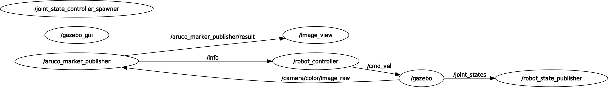
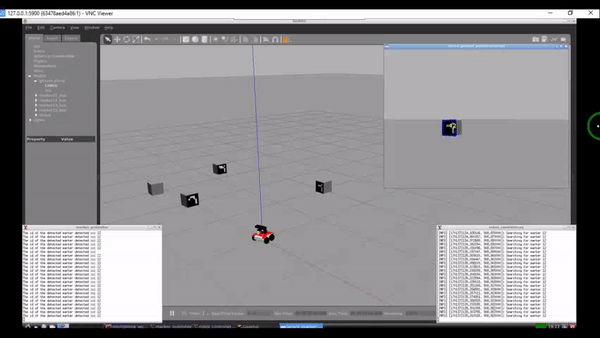

# Experimental Robotics Laboratory - Assignment 1

## 

- Shima Amiri Fard, 5269794


- Mohammadreza Koolani, 5467640


- Mohammad Sabouri, 5659227


- Reza Taleshi, 5029729

## Introduction

This project focuses on localizing, navigation and detecting four Aruco markers by a Rosbot in Gazebo simulation and with real robotm, which has a fixed camera.


The robot starts at the coordinates (0, 0), and there are four markers in the environment with IDs 11, 12, 13, and 15. The markers have the following meanings:
- Marker 11: Rotate until you find Marker 12; then reach Marker 12.
- Marker 12: Rotate until you find Marker 13; then reach Marker 13.
- Marker 13: Rotate until you find Marker 15; then reach Marker 15.
- Marker 15: Done! (Task completion marker)
  
**Note:** "Reach Marker xxx" means that one side of Marker xxx must be at least 200 pixels in the camera frame.


## Required Packages
This project depends on few packages which are included in the whole package:

- **ArUco:** The ARUCO Library has been developed by the Ava group of the Univeristy of Cordoba(Spain).  It provides real-time marker based 3D pose estimation using AR markers. You can download it here ([ArUco](https://github.com/CarmineD8/aruco_ros)) 
    
- **ROSbot Model:** Meta package that contains all packages of Rosbot 2 an Rosbot 2R PRO inclusing rosbot_bringup, rosbot_description, rosbot_gazebo and rosbot_controller . You can download it here ([ROSbot Model](https://github.com/husarion/rosbot_ros)) 
    
- **OpenCV:** a package which contains packages to interface ROS 2 with OpenCV which is a library designed for computational efficiency and strong focus for real time computer vision applications.You can download it here ([OpenCV](https://github.com/ros-perception/vision_opencv))  


## Architecture

 This project consists of two nodes:
- **Robot_controller Node:** Controls robot behavior and its written in python (its in **rosbot_bringup/scripts** folder).
- **Marker_publisher Node:** Detects Aruco markers and communicates information to the robot_controller node using a custum message called **Info.msg**. This node is the modified version of Marker_publish.cpp from Aruco package (its in **aruco_ros/src** folder).


### Rqt Graph

Here you can see rqt graph and figure out nodes relations:




### Pseudocode

You can find the Pseudocode of Robot_controller node:

```python

Initialize ROS node

Define a class for RobotController:
    Initialize variables for marker_list, marker_index, distance_th, misalignment_th, state, msg
    Initialize ROS publishers and subscribers for '/cmd_vel' and '/info' topics

    Callback function info_clbk(msg):
        Set self.msg to the received message

    Function search(marker_id):
        Create a Twist message for robot velocity
        If marker_id is equal to the current marker in marker_list:
            Log detection of marker
            Set angular velocity to 0
            Set state to 'align'
        Else:
            Log searching for marker
            Set angular velocity to 0.2
        Publish robot velocity

    Function align(marker_center):
        Log misalignment adjustment
        If the absolute difference between marker_center and 400 is greater than misalignment_th:
            Create a Twist message for robot velocity
            If marker_center is to the left of 400:
                Set angular velocity to 0.1 (turn left)
            Else:
                Set angular velocity to -0.1 (turn right)
            Publish robot velocity
        Else:
            Log alignment achieved
            Set state to 'drive'

    Function drive(marker_l):
        Log moving forward
        If marker_l is less than distance_th:
            Create a Twist message for robot velocity
            Set linear velocity to 0.2
            Publish robot velocity
        Else:
            Log reached the desired marker
            Increment marker_index
            If marker_index is less than the length of marker_list:
                Set state to 'search'
                Log moving to the next marker
            Else:
                Log all markers found
                Create a Twist message for robot velocity
                Set linear velocity to 0
                Publish robot velocity

    Main loop function main_loop():
        Set loop rate to 10 Hz
        While not rospy.is_shutdown():
            If state is 'search':
                Call search function with the current marker_id
            ElseIf state is 'align':
                Call align function with the current marker_center
            ElseIf state is 'drive':
                Call drive function with the current marker_l
            End If
            Sleep based on the loop rate

Main:
    Try:
        Create an instance of RobotController
        Call the main_loop function on the instance
    Except rospy.ROSInterruptException:
        Pass (do nothing)
```

## Simulation implementation

To download this project, you need to first clone the project: 
```bash
git clone https://github.com/shimaamiri/Experimental_Assignment1.git
```
Then, you need to build the project in the root directory:
```bash
catkin_make
```

### How to Run 
To run the program you need to launch the package launch file which is located in the rosbot_bringup/launch folder:

```bash
roslaunch rosbot_bringup assignment.launch
```
### Video

Here is the simulation video: 

[](https://youtu.be/CN031iupbz8?si=qhbarW10anAkJu2S)

## Real robot Implementation 

### How to Run

In the assignment package go to the main branch then follow one of the following methods to run the code with real robot.

- Share the ROS master with the ROSbot and execute the code from your PC. Ensure both are on the same network, and set the ROS_MASTER IP to match the ROSbot's.
- Install the package directly on the ROSbot, considering it has ROS Melodic and OpenCV installed.

Finally run the same launch file as in the simulation:

```bash
roslaunch rosbot_bringup assignment.launch
```

### Video

Here is the real robot video: 

[](https://youtu.be/g6Qjz7wffTg?si=LhuIllJXepSKKEYV)

## Drawback and Possible improvements

- In the simulation in ubuntu, robot couldnt detect the marker 12 so we used to manually change robot or marker position inorder to detect it. But, with Docker robot could easily detect marker 12. Also in reality, the robot could easily detect markers. This can be accounted as one the drawbacks of ArUco. Therefore, a possible improvement can be using OpenCv functionalities rather than relying on Aruco.


- One possible improvement can be defining a controler which control the robot speed depending on the error.


- Instead of reaching the markers sequentially and searching for next marker, a possible improvement can be associating each marker with a certain instruction that once the robot reach each marker does a specific task. 


